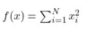
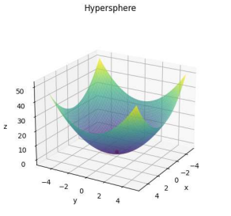
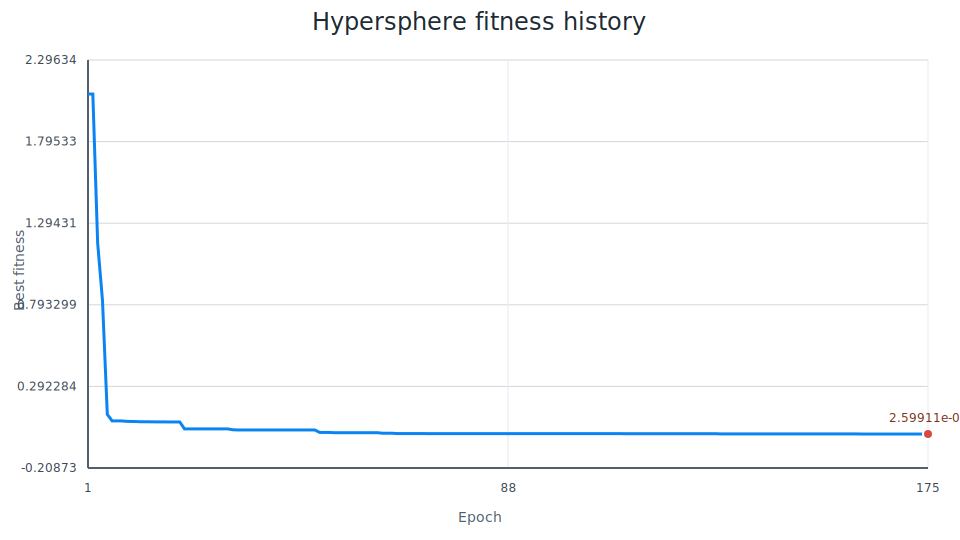
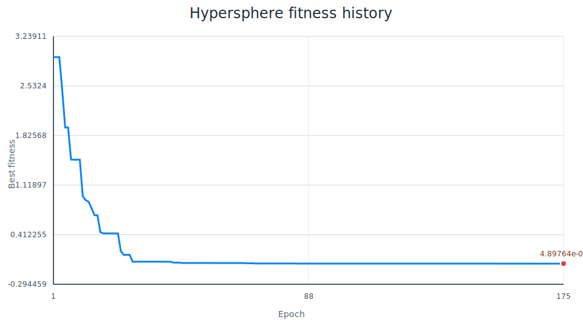
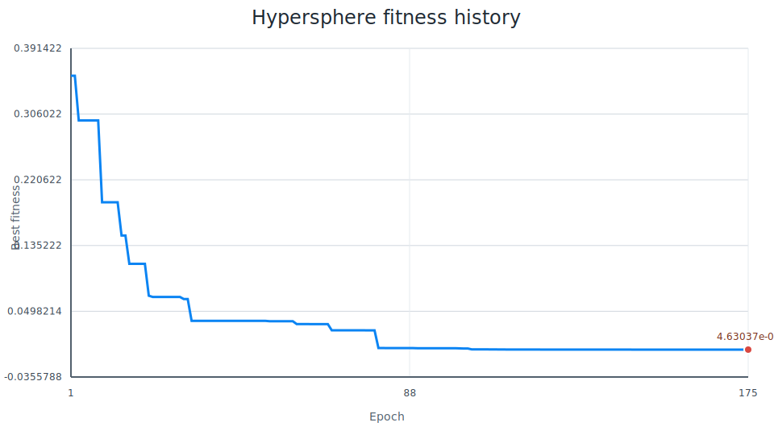

# Sprawozdanie z projektu Evolutionary Computations

## Autorzy
- Mateusz Bobula
- Norbert Dziwak
- Jakub Konopka

## 1. Technologie użyte w projekcie
- Python 3.12+
- PyQt6 do GUI
- benchmark-functions - funkcja testowa Hypersphere
- ruff - formater kodu
- uv - package manager

## 2. Wymagania środowiskowe
- Python 3.12
- venv z zainstalowanymi zależnościami z pyproject.toml
- uv

Uruchamianie aplikacji komendą uv run .\src\main.py

## 3. Opis wybranych funkcji testowych i ich optima
W aktualnej wersji aplikacji używana jest jedna funkcja testowa Hypersphere

Wzór funkcji:

- Funkcja jest separowalna i wypukła
- Wartość funkcji jest nieujemna
- Minimum globalne występuje w punkcie x = (0,...,0)
- W minimum globalnym wartość funkcji wynosi f(x) = 0

## 4. Wykresy wyników
Projekt ma gotowy mechanizm zapisu i wizualizacji przebiegu optymalizacji
- Dla każdego uruchomienia tworzony jest osobny katalog wyników
- Zapisywany jest plik summary.json z konfiguracją i wynikiem końcowym
- Zapisywany jest plik history.csv z najlepszym fitness dla każdej epoki
- Generowany jest plik fitness_history.svg jako wykres historii fitness

### Osadzone wykresy
#### Wspólny config dla wszystkich wykresów
Na podstawie plików summary.json wszystkie trzy przebiegi miały ten sam config bazowy
- Jedyna celowa zmiana między przebiegami to selection_method

| Parametr | Wartość |
| --- | --- |
| function | Hypersphere |
| a | -5.0 |
| b | 5.0 |
| dimensions | 3 |
| precision | 6 |
| population_size | 50 |
| epochs | 175 |
| crossover_method | single_point |
| crossover_prob | 0.8 |
| mutation_method | single_point |
| mutation_prob | 0.01 |
| inversion_prob | 0.05 |
| elite_size | 1 |
| minimize | true |

#### Wykres 1
Wykres dla selekcji `tournament`

Kluczowa wartość configu względem pozostałych
- selection_method = tournament

Co widać na wykresie
- Najmocniejsza poprawa jakości w piersze kilka epok
- Potem dłuższa faza stabilizacji

#### Wykres 2
Wykres dla selekcji `best`

Kluczowa wartość configu względem pozostałych
- selection_method = best

Co widać na wykresie
- Szybkie dojście schodkowe do wyniku

#### Wykres 3
Wykres dla selekcji `roulette`

Kluczowa wartość configu względem pozostałych
- selection_method = roulette

Co widać na wykresie
- Rownież schodkowy przebig, ale dłuższy
- Dojście bliskie rozwiązania dopiero koło 80 epoki

## 5. Porównanie wyników dla różnych konfiguracji algorytmu
Implementacja udostępnia parametry, które bezpośrednio wpływają na jakość i szybkość zbieżności
- Metoda selekcji: tournament, best, roulette
- Metoda krzyżowania (oraz jej prawdopodobieństwo): single_point, two_point, uniform, granular 
- Metoda mutacji (oraz jej prawdopodobieństwo): single_point, edge, two_point
- Prawdopodobieństwo inwersji
- Rozmiar populacji
- Liczba epok
- Rozmiar elity

Kierunek porównania konfiguracji
- Większa populacja zwykle poprawia eksplorację kosztem czasu obliczeń
- Większa liczba epok zwykle poprawia końcowy wynik kosztem czasu
- Selekcja tournament może dawać stabilne postępy przy poprawnym doborze rozmiaru turnieju. W naszym eksperymencie zbiegała ona najszybciej do poprawnego rozwiązania, natomiast miała potem problem ze znalezniem dokładniejszego rozwiązania.
- Zbyt wysoka mutacja pogarsza stabilizację rozwiązania
- Elityzm przyspiesza utrzymanie dobrych osobników ale może ograniczać różnorodność

Zestawienie końcowych wyników

| Przebieg | selection_method | best_fitness | elapsed_seconds |
| --- | --- | ---: | ---: |
| Tournament | tournament | 2.5991082520405703e-05 | 0.1211451 |
| Best | best | 4.897643319657252e-06 | 0.1033877 |
| Roulette | roulette | 4.630370506111484e-06 | 0.1125114 |

Wniosek z samej wartości końcowej
- Najlepszy wynik końcowy uzyskał `roulette`
- Drugi wynik uzyskał najszybszy `best`
- Najsłabszy wynik końcowy uzyskał `tournament`, który był również najwolniejszy

Wnioski z porównania
- Sama zmiana metody selekcji istotnie zmieniła dynamikę zbieżności
- Selekcja `best` i roulette dały wyraźnie lepsze wartości końcowe niż tournament
- Tournament miał najszybszy progress, jednak potem miał problem nadgonić
- `roullete` z najlepszym wynikiem zbiegało najwolniej, mimo to osiągnęło najlepszy wynik końcowy (ale nie dużo lepszy niż `best`)

## 6. Podsumowanie i analiza błędów
Podsumowanie
- Aplikacją GUI do optymalizacji funkcji Hypersphere algorytmem genetycznym
- Formularz do konfiguracji funkcji, zapis do plików, oraz generowanie wykresu.

Analiza błędów i ryzyk
- Jakość wyniku zależy od doboru parametrów i losowości procesu ewolucyjnego
- Praca z liczbami zmiennoprzecinkowymi (overflow itp.)
- Nie implementowaliśmy unit testów